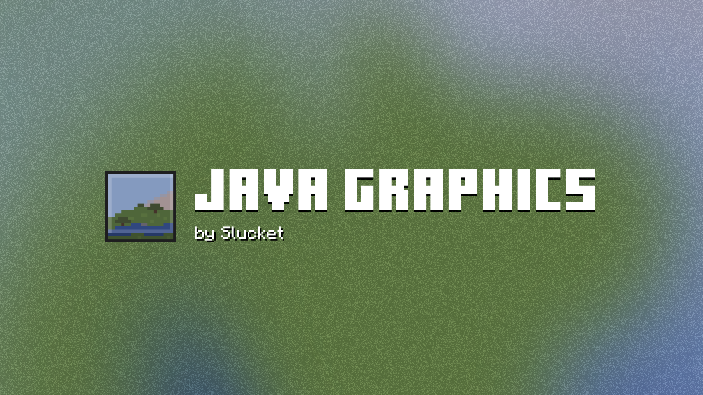
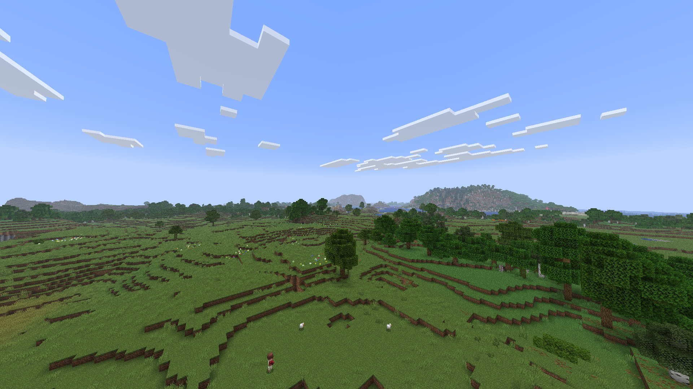
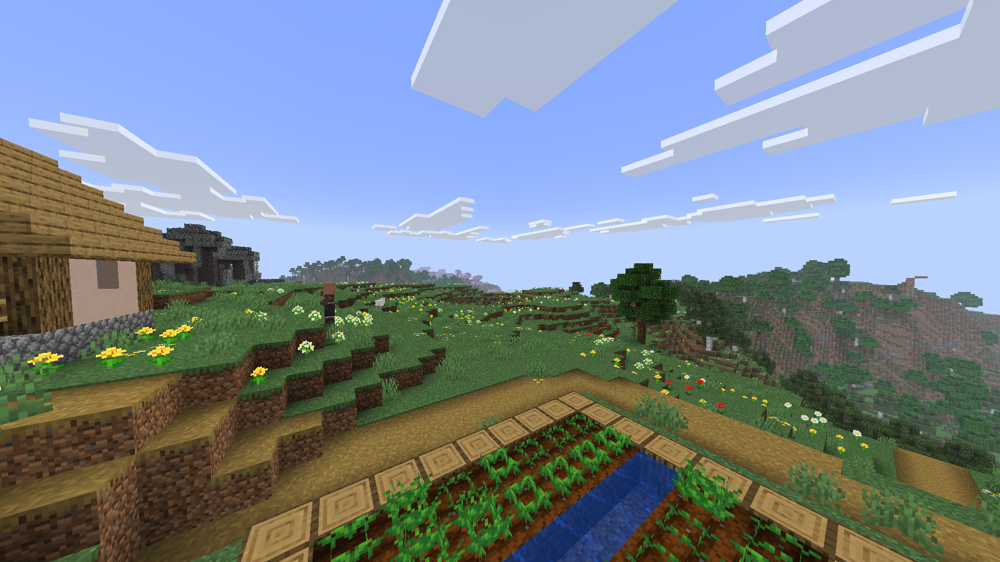
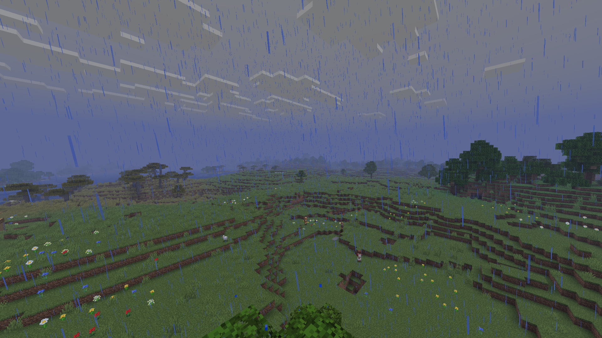
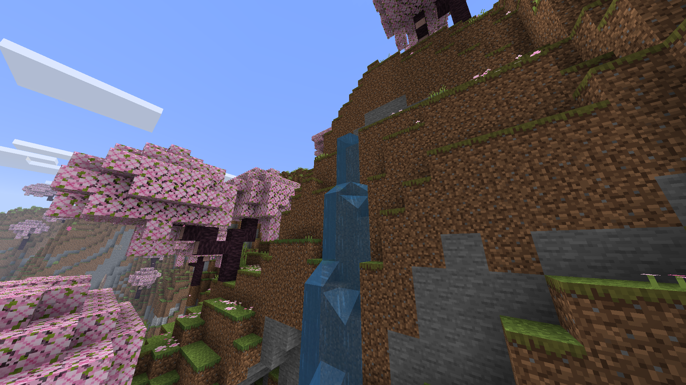
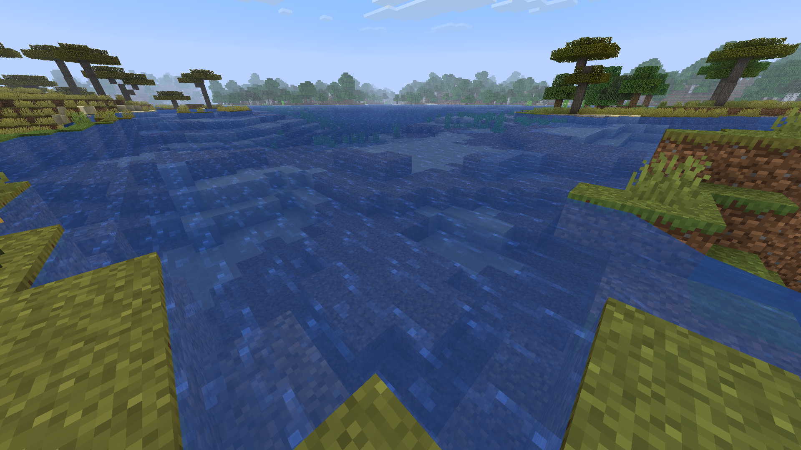
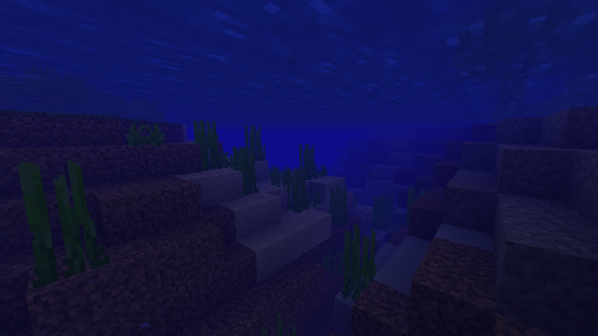
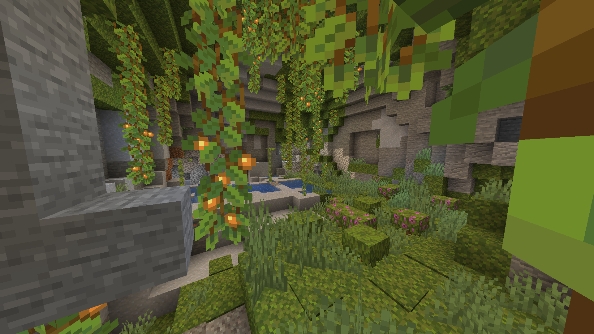

# Java Graphics
A simple Minecraft Bedrock resource pack that aims to improve the standard Bedrock graphics and make it better match Minecraft Java. It changes the overall world appearance like fogs, colors, End Portals and much more.

## Screenshots

Overall world appearance

Meadow biome grass color

Weather Fog demonstration

Waterfall in a Chery Grove

Water texture and color

Underwater appearance

Lush Caves look with updated grass color

## Downloads
You can download the latest pack update from [here](https://github.com/Slucket/Java-Graphics/releases).

## Contacts
- [Telegram](https://t.me/Slucket) 
- [X (Twitter)](https://x.com/Sluck_et)
